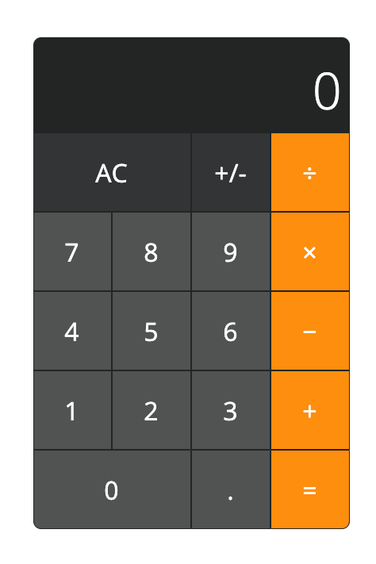

# Calculator
Calculator app created with HTML, CSS & Javascript for The Odin Project.

## Demo
Here is a working live demo: https://kapaha.github.io/calculator/

## General info
This project was created as a part of the [Web Development 101](https://www.theodinproject.com/courses/web-development-101/lessons/calculator) course with [The Odin Project](https://theodinproject.com). The aim of this project was to combine the knowledge of HTML, CSS & Javascript I have learnt throughout the course.

## Features
* Clear button - changes between all-clear and clear-entry mode based on calculator state
* Negate button - negates the displayed value (removes or adds minus sign)
* Consecutive calculations - calculations made one after the other without the use of the equal key

## Built with
* HTML
* CSS
* Javascript

## Status
The project is finished, however I may continue to improve on it as my knowledge of web development improves.
